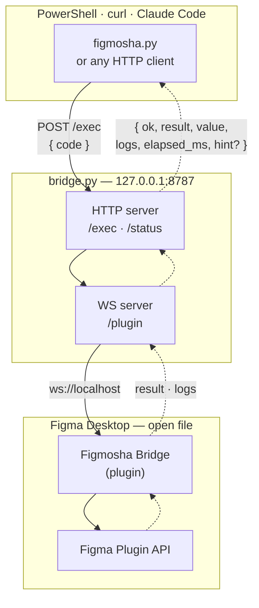

# Figmosha 2.0

Drive Figma from your terminal / Claude Code / any HTTP client. A tiny custom plugin sits inside Figma Desktop and holds a WebSocket to a local Python server — you send Figma Plugin API code over HTTP and get the result back.

No clipboard hacks. No screenshots.

Fast enough to feel synchronous: reads ~5 ms, mutations ~30 ms, library component import ~150 ms.

## Why this exists

The Figma Plugin API is the most stable and powerful interface Figma offers. Thousands of plugins depend on it. But typically it's only accessible *inside* Figma's UI — you click "Run plugin", code executes, results appear in a panel.

Figmosha 2.0 keeps a plugin permanently open in Figma and exposes its Plugin API through a local network socket. You write code in your editor / Claude / a script, it runs inside Figma, and the result comes back to you.



Solid arrows carry the request, dotted ones the response.

## Highlights

- **One Python file** server + **one Python file** CLI, ~500 lines total. No npm. No frameworks.
- **Custom Figma plugin**, ~250 lines (JS + HTML). Imported in dev mode — no publishing.
- **20 helpers** baked into the plugin runtime as `h.*` so scripts stay short and safe (`h.bF`, `h.setText`, `h.withFonts`, `h.frame`, `h.hex`, `h.sel`, …).
- **11 high-level CLI subcommands** for common ops (`doctor`, `sel`, `tree`, `find`, `text`, `variant`, `clone`, `rm`, `icomp`, …).
- **`figmosha doctor`** walks the whole chain — bridge, plugin, round trip, which file is open — and names the fix at whichever link is broken.
- **Smart error hints** in responses — when a script fails with a known-pattern error, the response includes a `hint` field telling you how to fix it.
- **Works while Figma is minimized.** WebSocket stays alive; JavaScript keeps executing in the background.
- **Auto-reconnect** in the plugin UI — restart the server, plugin reconnects within 2 s.

## Requirements

- **Figma Desktop** (Stable or Beta) — [download](https://www.figma.com/downloads/). The browser version cannot import local development plugins.
- **Python 3.10+** — for the bridge server and CLI client. Stdlib + a single dependency (`aiohttp`).
- **OS**: macOS, Windows (native or WSL2), or Linux.

## Install

Hand this repo to Claude Code and let it do the setup:

```
https://github.com/denysosadchyi/figmosha2 — set this up for me
```

It clones the repo, creates the venv, installs `aiohttp`, starts the bridge, and tells you what to click in Figma. `CLAUDE.md` in the repo root is written for exactly this — Claude reads it and knows the whole workflow, including the WSL2 path juggling if that's your setup.

Two things Claude cannot do for you, because Figma exposes no API for either:

1. **Import the plugin** — in Figma Desktop: **Plugins → Development → Import plugin from manifest…**, pick `plugin/manifest.json` from the repo. Once, ever.
2. **Run the plugin** — **Plugins → Development → Figmosha Bridge**. A small green **Connected** bar appears; the bridge logs `[plugin] connected from 127.0.0.1`. You're live.

Ask Claude for the smoke test and it will confirm the round trip works end to end.

<details>
<summary>Prefer to do it by hand?</summary>

```bash
git clone https://github.com/denysosadchyi/figmosha2.git
cd figmosha2

python3 -m venv venv && ./venv/bin/pip install aiohttp   # macOS / Linux / WSL
python  -m venv venv && .\venv\Scripts\pip install aiohttp   # Windows

bash start-bridge.sh        # detached tmux session "figmosha-bridge"
./venv/bin/python bridge.py # …or just keep a terminal open
```

The server listens on `127.0.0.1:8787`. Import and run the plugin as described above, then check it:

```bash
./venv/bin/python figmosha.py status
# → {"plugin_connected": true, "pending": 0}

./venv/bin/python figmosha.py "return figma.currentPage.name"
# → "Page 1"
```

**WSL2**: `localhost` ports forward to the Windows host automatically, so a bridge inside WSL is reachable from Figma on Windows. But Figma can only import a plugin from a Windows path — copy it out first:

```bash
mkdir -p /mnt/c/Users/$WIN_USER/figmosha-plugin
cp plugin/* /mnt/c/Users/$WIN_USER/figmosha-plugin/
```

Then import `C:\Users\<your-name>\figmosha-plugin\manifest.json`.

</details>

## Daily use

### Start a session

```bash
bash start-bridge.sh     # macOS / Linux / WSL — detached tmux session
.\start-bridge.ps1       # native Windows — detached, -Restart / -Stop too
# In Figma: Plugins → Development → Figmosha Bridge → Run
```

The bridge survives SSH disconnects and terminal closes (tmux). It does **not** survive OS reboot or WSL shutdown — restart it after either.

### Send code

```bash
# Inline JS
python figmosha.py "return figma.currentPage.children.length"

# From a file
python figmosha.py exec --file my-script.js

# From stdin
cat my-script.js | python figmosha.py exec --stdin

# Plain HTTP (no Python needed)
curl -s http://localhost:8787/exec \
  -H 'Content-Type: application/json' \
  -d '{"code":"return 1+1"}'
```

### High-level CLI commands

When the operation fits one of these, use the dedicated subcommand — much less typing and less risk of escape bugs:

```bash
python figmosha.py doctor                        # diagnose the chain, with fixes
python figmosha.py sel                           # what's selected in Figma right now
python figmosha.py tree 1:23 --depth 2           # dump subtree
python figmosha.py tree sel --layout             # subtree of the selection, with layout
python figmosha.py find 1:23 name=Button         # find by exact name
python figmosha.py find 1:23 name~Btn            # substring name match
python figmosha.py find 1:23 type=INSTANCE       # filter by type
python figmosha.py find 1:23 text~hello          # find TEXT containing "hello"
python figmosha.py text 1:25 "new content"       # set TEXT chars (autoloads fonts)
python figmosha.py variant 1:30 "Property 1=Default"
python figmosha.py clone 1:23 --right --gap 100  # clone adjacent
python figmosha.py rm 1:99 1:100 1:101           # delete one or more nodes
python figmosha.py icomp <component-key>         # import library component, place + zoom
python figmosha.py status                        # bridge + plugin connection state
```

## Code conventions

The plugin wraps your code as:

```js
new Function("figma", "print", "h", `return (async () => { <YOUR CODE> })();`)(figma, print, HELPERS)
```

- `await` works everywhere. Body is wrapped in an async IIFE.
- Whatever you `return` becomes the HTTP response's `result` (string) and `value` (raw JSON-serializable form).
- `print(...)` collects lines into the `logs` array — also streamed to the plugin UI for live debugging.

### Helpers (available as `h.*` in every exec)

| Helper | Use |
|---|---|
| `await h.bF(node, idx, varOrId)` | Bind fill paint at `idx` to variable (handles frozen-array dance) |
| `await h.bS(node, idx, varOrId)` | Bind stroke paint to variable |
| `await h.bN(node, prop, varOrId)` | Bind numeric prop (radius, padding, size, itemSpacing, …) |
| `h.findByName(root, name)` | First descendant with exact name |
| `h.findAllByName(root, name)` | All descendants with exact name |
| `h.dumpTree(node, {maxDepth, showSize, showText, showLayout})` | Indented tree string |
| `await h.withFonts(root, asyncFn)` | Auto-loads every unique font in the subtree, then runs your callback |
| `await h.setText(node, text)` | Sets `node.characters` with auto font load (single-font nodes only) |
| `h.cloneNext(node, {direction, gap, name})` | Clone + place adjacent (`right`/`left`/`up`/`down`) |
| `await h.variant(instance, props)` | Wrapper around `instance.setProperties(...)` |
| `await h.variantsOf(instance)` | `{current, groups, all}` of the component set |
| `h.sel()` | Currently selected nodes as `{id,name,type,w,h}` |
| `h.resolve(idOrAlias)` | Node by id, or the aliases `page` / `sel` |
| `h.hex("#1a2b3c")` | Hex to Figma's 0..1 `{r,g,b}` |
| `h.solid("#1a2b3c", opacity?)` | Ready-to-assign paint array |
| `h.frame(parent, opts)` | Frame with auto-layout applied in the right order |
| `await h.node(id)` | Shorthand for `figma.getNodeByIdAsync(id)` |
| `await h.var_(idOrKey)` | Resolve variable from instance, local id, or library key |
| `await h.importComp(key)` | `figma.importComponentByKeyAsync(key)` |
| `await h.importVar(key)` | `figma.variables.importVariableByKeyAsync(key)` |

Compared to inlined boilerplate, helpers reduce a typical script by ~60–70% and avoid common gotchas (frozen `node.fills`, missing `loadFontAsync`, deprecated sync `getVariableById`).

### Error hints

When a script fails with a recognized pattern, the response includes a `hint` field. The CLI prints it for you:

```
$ figmosha.py "node.characters = 'x'"
figmosha: Cannot write to node with unloaded font "Inter Regular"...
   hint: use h.setText(node, text) or h.withFonts(root, fn) — they autoload fonts
```

Currently hints cover: fills/strokes variable binding, frozen arrays, missing manifest permissions, unloaded fonts, appendChild order, invalid variant values, and a few more.

## Limits / gotchas

- Plugin is bound to the **currently open Figma file**. Switching files closes the plugin — re-Run it in the new file.
- Only **one plugin instance** connects to the server at a time. Opening the plugin in a second Figma window is rejected.
- **Figma sync errors** ("Unable to establish connection to Figma after 10 seconds") sometimes appear when fetching nodes from non-current pages. If you need cross-page access: `await figma.loadAllPagesAsync()` first.
- Bridge binds to `127.0.0.1` by default. For LAN access: `python bridge.py --host 0.0.0.0` (not recommended — anyone on your LAN can then run arbitrary code in your Figma).
- Manifest changes (new permissions, etc.) require **re-importing** the plugin in Figma. `code.js` and `ui.html` changes are picked up on next Run.

## Troubleshooting

| Symptom | Cause | Fix |
|---|---|---|
| `connection refused` from CLI | Server not running | `bash start-bridge.sh` (or run `bridge.py` in a terminal) |
| `plugin not connected` (503) | Plugin window closed | Plugins → Development → Figmosha Bridge → Run |
| Plugin says `disconnected, retrying…` | Server is down or restarting | Start it; plugin auto-reconnects within 2 s |
| 504 timeout | Code threw silently or `await` never resolved | Close the plugin (X), Run again. Increase `--timeout` for legitimately long ops |
| `permission not specified in manifest` | API needs a permission not declared in `manifest.json` | Add to `permissions` array, sync to Windows path if applicable, **re-import** plugin |
| `Cannot write to node with unloaded font` | Need to load fonts first | Use `await h.setText(...)` or wrap edits in `h.withFonts(root, fn)` |
| `Cannot assign to read only property` | `node.fills` is frozen | Use `await h.bF(node, idx, varId)` or copy: `JSON.parse(JSON.stringify(node.fills))` |
| `pip install aiohttp` fails on Linux | Python externally-managed environment (PEP 668) | Use the venv approach (always preferred) or `pip install --user --break-system-packages aiohttp` |
| Tmux not installed (Windows native) | `start-bridge.sh` won't work | Run `python bridge.py` in a regular terminal instead |

## Project layout

```
bridge.py              HTTP/WS server (~200 lines)
figmosha.py            CLI client (~300 lines)
start-bridge.sh        tmux-based bridge management
plugin/
  manifest.json        Permissions + allowed origins
  code.js              Plugin sandbox: exec + helpers
  ui.html              WS client + auto-reconnect + status bar
CLAUDE.md              Conventions for Claude Code sessions driving Figmosha
README.md              This file
```

## Contributing / extending

The plugin runtime is just `new Function("figma", "print", "h", body)`. Add helpers to `HELPERS` in `plugin/code.js`, sync the file to your plugin path, and they're available in your next `exec`.

To add a new CLI subcommand:
1. Add a `cmd_<name>(args)` function in `figmosha.py` that builds JS via `json.dumps`-escaped templates
2. Add a subparser in `build_parser()`
3. Register in the `dispatch` map

To add an error hint:
1. Append a `(needle, hint)` tuple to `ERROR_HINTS` in `bridge.py`
2. Restart the bridge

## License

MIT

## Tests

No Figma needed — a fake plugin drives the bridge over a real WebSocket:

```bash
pip install pytest aiohttp
pytest -q            # bridge: guard, exec round trip, timeouts, slot handover
node tests/helpers.test.js   # pure helpers: hex maths, auto-layout ordering
```
