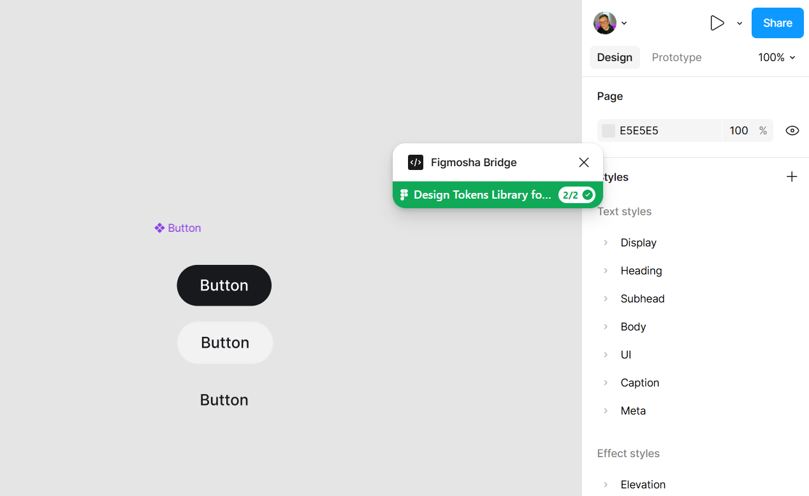
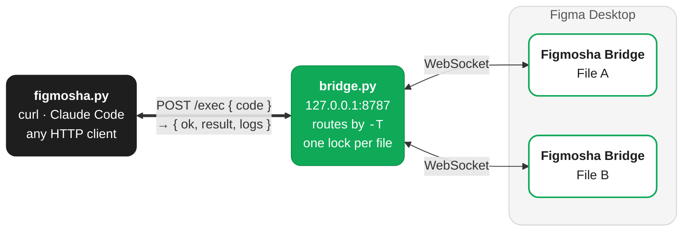

# Figmosha 2.0

Drive Figma from your terminal, from coding agents (Claude Code, Codex…) or from any HTTP client. A tiny custom plugin sits inside Figma Desktop and holds a WebSocket to a local Python server — you send Figma Plugin API code over HTTP and get the result back. Several agents can work in several Figma files at once.

No clipboard hacks. No screenshots.

Fast enough to feel synchronous: a round trip is ~2 ms over HTTP (~100 ms through the CLI, which is mostly Python starting up); a library component import ~150 ms.



## What's new

**Several agents, several files**

- **Many Figma files at once.** Run the plugin in each file; pick one with
  `-T "<file name>"` or its stable document id from `figmosha targets` — two
  files that are both called "Untitled" are told apart.
- **A queue per file.** Agents writing to the same file run one after another,
  never interleaved; agents in different files run in parallel (measured: two
  files ≈ 2× the throughput of one). `targets` shows who is running and who is
  waiting; agents name themselves with `--agent`.
- **Bounded waits.** `--queue-timeout 30` gives up with `503 file busy` — and a
  busy reply guarantees nothing ran, so retrying is safe.
- **Timeouts can't corrupt a file.** A script that outlives its timeout keeps the
  file locked until it really ends, and `h.ck()` in a loop stops it right at its
  timeout — even a tight loop that never yields.

**Faster**

- **Every CLI call on Windows: 2.1 s → 0.1 s.** `localhost` tried IPv6 first and
  waited for it to fail; the bridge now listens on both.
- Big results come back about twice as fast, and `print()`-heavy scripts ~14×.

**Easier to run**

- **macOS / Linux:** `start-bridge.sh` no longer needs tmux or a venv, has
  `--stop`, and explains a busy port. **Windows:** `start-bridge.ps1` works in the
  stock PowerShell 5.1, in folders with spaces, and on non-English Windows.
- **Codex and other agents** read the same instructions as Claude Code
  (`AGENTS.md`).
- **The plugin bar tells you what's going on:** the file's name, a `1/2` pill with
  several files, a spinner while a script runs, red on an error, purple when the
  plugin runs old code ("re-run plugin"), and blue with an **Update** button when
  a newer Figmosha is on GitHub.

**Tested hard** — ~130 tests plus a scenario fuzzer (1000 random scenarios pass
on Windows and Linux), stress and chaos runs, attacks on the request guard, and
`tests/live_stress.py` against your own open files. They found and fixed ~15
bugs, among them files that could stay locked forever and a second writer
slipping into a busy file.

Full details in the [CHANGELOG](CHANGELOG.md) and
[Multiple files & concurrency](#multiple-files--concurrency).

## Why this exists

The Figma Plugin API is the most stable and powerful interface Figma offers. Thousands of plugins depend on it. But typically it's only accessible *inside* Figma's UI — you click "Run plugin", code executes, results appear in a panel.

Figmosha 2.0 keeps a plugin permanently open in Figma and exposes its Plugin API through a local network socket. You write code in your editor / Claude / a script, it runs inside Figma, and the result comes back to you.


```mermaid
flowchart LR
    CLI("<b>figmosha.py</b><br/>curl · Claude Code<br/>any HTTP client")

    BRIDGE("<b>bridge.py</b><br/>127.0.0.1:8787<br/>routes by <code>-T</code><br/>one lock per file")

    subgraph figma["Figma Desktop"]
        P1("<b>Figmosha Bridge</b><br/>File A")
        P2("<b>Figmosha Bridge</b><br/>File B")
    end

    CLI <== "POST /exec { code }<br/>→ { ok, result, logs }" ==> BRIDGE
    BRIDGE <-- "WebSocket" --> P1
    BRIDGE <-- "WebSocket" --> P2

    classDef client fill:#1e1e1e,stroke:#1e1e1e,color:#ffffff,rx:12,ry:12
    classDef bridge fill:#0fa958,stroke:#0b8a48,color:#ffffff,rx:12,ry:12
    classDef plugin fill:#ffffff,stroke:#0fa958,stroke-width:2px,color:#1e1e1e,rx:12,ry:12
    class CLI client
    class BRIDGE bridge
    class P1,P2 plugin
    style figma fill:#f5f5f5,stroke:#d0d0d0,color:#555555,rx:16,ry:16
```

Each arrow carries a request out and its result back. Every open file running the plugin gets its own connection.

## Highlights

- **One Python file** server + **one Python file** CLI, ~1,600 lines total. One dependency (`aiohttp`). No npm. No frameworks.
- **Custom Figma plugin**, ~800 lines (JS + HTML). Imported in dev mode — no publishing.
- **22 helpers** baked into the plugin runtime as `h.*` so scripts stay short and safe (`h.bF`, `h.setText`, `h.withFonts`, `h.frame`, `h.hex`, `h.sel`, `h.ck`, …).
- **13 high-level CLI subcommands** for common ops (`doctor`, `targets`, `sel`, `tree`, `find`, `text`, `variant`, `clone`, `rm`, `icomp`, `clear`, …).
- **`figmosha doctor`** walks the whole chain — bridge, plugin, round trip, which file is open — and names the fix at whichever link is broken.
- **Smart error hints** in responses — when a script fails with a known-pattern error, the response includes a `hint` field telling you how to fix it.
- **Works while Figma is minimized.** WebSocket stays alive; JavaScript keeps executing in the background.
- **Several agents, several files** — a queue per document, bounded waits, and a timeout interlock, so concurrent agents never interleave writes in one file.
- **Auto-reconnect** in the plugin UI — restart the server and the plugin is back within 2 s.
- **Tells you when to update** — re-run a plugin running old code, `git pull` when GitHub has a newer version.
- **Tested without Figma** — fake plugins drive the real WebSocket: unit, stress, chaos and fuzz tests on Windows and Linux.

## What you can do with it

Anything the Figma Plugin API can do — which is most of what you can do by hand,
minus the clicking. In practice it comes down to the jobs that are miserable
manually because they repeat:

**Read the file.** Walk the node tree, find layers by name, type or their text,
dump a subtree with sizes and auto-layout settings, list local variables and
component sets, read what the user has selected right now.

**Edit content.** Set text on TEXT nodes with fonts loaded automatically —
including bulk passes over a whole subtree, where collecting every unique font
first is otherwise your problem. Rename layers, move and resize, clone next to
the original.

**Build structure.** Create frames, components and component sets, apply
auto-layout, nest and reorder. `h.frame` applies the properties in the order
Figma actually requires, which is not the order you'd guess.

**Work with the design system.** Bind fills, strokes, radii, padding, spacing
and sizes to variables. Import components and variables from a team library by
key. Switch instance variants, and ask what variants are even available.

**Get pixels out.** `node.exportAsync` returns PNG/SVG/PDF bytes; encode them
with `figma.base64Encode` and decode on the client side.

A worked example — build a three-variant button, then bind every colour and
every measurement to design tokens by name:

```bash
python figmosha.py exec --file build-button.js   # structure, hardcoded colours
python figmosha.py exec --file bind-tokens.js    # walk by name, bind variables
python figmosha.py "return h.dumpTree(await h.resolve('sel'), {showLayout:true})"
```

Splitting build from bind is the recommended shape for anything non-trivial:
each half is verifiable on its own, and a failure in the second doesn't leave
you guessing which half broke.

### What it can't do

- **Anything outside an open file.** Each plugin is bound to the Figma file it
  runs in; the bridge can route between files that run the plugin (see
  [Multiple files & concurrency](#multiple-files--concurrency)), but there are
  no cross-file operations inside one script and no file browser.
- **The parts Figma keeps to itself** — publishing to Community, plugin icons,
  account settings, comments (use the REST API for those).
- **Run without Figma Desktop open.** This is a bridge, not a headless renderer.
- **Survive a plugin restart mid-script.** Long operations are not resumable.

## HTTP API

The CLI is a convenience; the wire protocol is a handful of endpoints and no
authentication beyond being on the machine.

| Endpoint | Body | Returns |
|---|---|---|
| `POST /exec` | `{code, timeout?, target?, parallel?, agent?, queue_timeout?}` | `{ok, result, value, logs, elapsed_ms, notice?}` — `notice` when the plugin or bridge runs stale code |
| `GET /status` | — | `{plugin_connected, plugin_version, bridge_outdated, update, files, pending, abandoned}` — each file has `plugin` and `outdated`; `update` is `{behind, url}` when GitHub has newer commits |
| `GET /targets` | — | `{files: [{name, fileKey, conn}]}` — connected Figma files |
| `POST /clear` | `{target?, force?}` | drops a file's abandoned-script interlock |
| `GET /` | — | service banner listing the endpoints |
| `WS /plugin` | — | where the Figma plugin connects (one per open file) |

```bash
curl -s -X POST http://localhost:8787/exec \
  -H 'Content-Type: application/json' \
  -d '{"code":"return figma.currentPage.name"}'
```

- `result` is your return value stringified; `value` is the same thing raw, when
  it survives JSON.
- `logs` collects everything `print(...)` emitted during the run.
- Failures come back `500` with `{ok: false, error, hint?, stack, logs}`.
- No plugin connected is `503`; a script that outlives its `timeout` is `504`.
- Bodies and WebSocket frames are capped at 16 MB, which is the practical limit
  on how large an export you can pull through in one call.

## Multiple files & concurrency

The bridge holds **one connection per open Figma file** running the plugin, not
one globally. Run the plugin in each file you want to drive; the plugin reports
its identity (`figma.root.name`, `figma.fileKey` where available, and a document
signature), and the bridge routes by it. Each plugin bar shows its file's name,
and with two or more files connected a `1/2 ✓` pill says which window this is
and how many are open.

```bash
python figmosha.py targets                          # name / doc id / fileKey / conn / queue
python figmosha.py exec "return figma.root.name" -T "Component Library"
curl -s -X POST http://localhost:8787/exec -d '{"code":"...","target":"Component Library"}'
```

Target resolution: document id (`doc` in `targets`) → connection id → exact
file name (case-insensitive) → exact `fileKey` → unambiguous substring of the
name.

- No target with exactly one file connected routes there — the old behavior.
- No target with two or more connected is `409` ("N files connected — specify a
  target"), and so is an ambiguous substring. Nothing connected stays `503`.
- **The same file open in several tabs or windows is fine.** Each view registers
  its own connection, and `-T` routes to the newest live one. They edit the same
  document, so the caller cannot end up in "the other copy"; `/status` flags the
  extra views with `sameDocAs`.
- **Two different files that happen to share a name** (two fresh "Untitled"
  files) are never guessed: the name is a `409`, and `-T <doc id>` picks one.
  The bridge tells them apart by a document id the plugin stores in each file's
  plugin data the first time it runs there, so it survives reconnects —
  `figma.fileKey` is null for a local dev plugin, `figma.root.id` is `"0:0"`
  everywhere, and page ids don't work either: every new file starts with page
  `0:1`.
- Re-running the plugin in a file replaces its previous connection at `hello`
  time **only if that connection is dead** — socket already closed, or no answer
  to a 1s liveness ping. A live one keeps its slot, so a re-Run never locks you
  out and two open views never evict each other.

**Each file has a queue.** Each file's plugin sandbox is a single-threaded
async message handler over one shared document and one shared undo stack — two
concurrent scripts interleave at every `await`, invalidating each other's
`findAll` snapshots mid-run. So `/exec` waits its turn on the document's lock:
callers on the same file run one after another, callers on different files never
wait for each other, and one file open in two tabs is still one queue. One exec
is one transaction: a read-modify-write split across two calls still lets
another writer land in the gap.

```bash
export FIGMOSHA_AGENT=designer                      # name shown in the queue (or --agent)
python figmosha.py exec --file build.js -T Icons --queue-timeout 30
python figmosha.py targets
# Icons   dk2m9q4xmuwk   -   3a2a5647   busy: designer 4s, waiting: copywriter, qa
```

- `--queue-timeout` (`queue_timeout`, default = the exec's `timeout`) caps the
  wait. When it runs out the reply is `503 file busy`, naming who holds the file,
  and **nothing was run** — so retrying is safe.
- Replies that waited carry `queued_ms`. A caller that hangs up while queued is
  dropped; its script never runs, so a client-side timeout can't turn into a
  surprise write later.

- Read-only scripts can pass `--parallel` (`{"parallel": true}`) to bypass the
  lock and fan out. Reads only — a parallel writer interleaves exactly as before.
- **A `504` does not mean the write didn't happen.** A script already running in
  the sandbox cannot be killed, so on timeout the bridge marks it *abandoned*
  and returns the `504` with a `warning` and the request id. While a file has an
  abandoned script, further execs on it return `409` instead of racing an
  invisible writer. The interlock lifts by itself when the orphan finally
  replies, or manually with `figmosha.py clear -T <file>` (`{"force": true}` on
  `/exec` pushes past it).
- Long loops can cooperate with cancellation: `h.ck()` throws once the bridge
  has abandoned the run, so a chunked sweep calling it each iteration stops
  instead of mutating under the next caller. `h.aborted()` is the non-throwing
  check.

## Security

The bridge executes arbitrary JavaScript inside whichever Figma file you have
open. That makes every web page in your browser part of the threat model —
binding to `127.0.0.1` keeps other machines out, not other tabs.

Two checks handle it:

- **Origin** — local clients (curl, the CLI) never send this header and browsers
  always do on cross-origin requests, so its presence alone means the request
  came from a page, and it's refused. This closes the "simple request" trick of
  posting JSON as `text/plain` to dodge a CORS preflight. The plugin's sandboxed
  iframe reports `null` and is allowed through on the WebSocket only.
- **Host** — pinned to the loopback names actually served, which closes DNS
  rebinding, where a page re-points its own hostname at `127.0.0.1` to become
  same-origin with the bridge and read the responses.

`--host 0.0.0.0` disables the Host check, because the reachable names are then
unknowable. The bridge says so loudly at startup. Don't do it on a network you
share.

The bridge makes one outgoing request of its own: every 6 hours it asks the
GitHub API how many commits your checkout is behind `master` (it sends the
commit id, nothing else), so the plugin bar can offer an update. Set
`FIGMOSHA_NO_UPDATE_CHECK=1` to turn that off.

## Requirements

- **Figma Desktop** (Stable or Beta) — [download](https://www.figma.com/downloads/). The browser version cannot import local development plugins.
- **Python 3.10+** — for the bridge server and CLI client. Stdlib + a single dependency (`aiohttp`).
- **OS**: macOS, Windows (native or WSL2), or Linux.

## Install

Hand this repo to a coding agent — Claude Code, Codex, or any agent that reads `AGENTS.md` — and let it do the setup:

```
https://github.com/denysosadchyi/figmosha2 — set this up for me
```

It clones the repo, creates the venv, installs the requirements, starts the bridge, and tells you what to click in Figma. `AGENTS.md` in the repo root is written for exactly this — Codex reads it directly, Claude Code through `CLAUDE.md`, which imports it — so the agent knows the whole workflow on macOS, Linux, WSL2 or native Windows.

Two things the agent cannot do for you, because Figma exposes no API for either:

1. **Import the plugin** — in Figma Desktop: **Plugins → Development → Import plugin from manifest…**, pick `plugin/manifest.json` from the repo. Once, ever.
2. **Run the plugin** — **Plugins → Development → Figmosha Bridge**. A small green bar with the file's name appears; the bridge logs `[plugin] connected from 127.0.0.1`. You're live.

Ask the agent for the smoke test and it will confirm the round trip works end to end.

<details>
<summary>Prefer to do it by hand?</summary>

```bash
git clone https://github.com/denysosadchyi/figmosha2.git
cd figmosha2

python3 -m venv venv && ./venv/bin/pip install -r requirements.txt     # macOS / Linux / WSL
python  -m venv venv; .\venv\Scripts\pip install -r requirements.txt   # Windows (PowerShell)

bash start-bridge.sh        # background (tmux session if tmux is installed); --stop to stop
.\start-bridge.ps1          # native Windows, detached
./venv/bin/python bridge.py # …or just keep a terminal open
```

The server listens on `127.0.0.1:8787`. Import and run the plugin as described above, then check it:

```bash
./venv/bin/python figmosha.py status
# → {"plugin_connected": true, "pending": 0}

./venv/bin/python figmosha.py "return figma.currentPage.name"
# → "Page 1"
```

**WSL2**: `localhost` ports forward to the Windows host automatically, so a bridge inside WSL is reachable from Figma on Windows. But Figma can only import a plugin from a Windows path — copy it out first:

```bash
mkdir -p /mnt/c/Users/$WIN_USER/figmosha-plugin
cp plugin/* /mnt/c/Users/$WIN_USER/figmosha-plugin/
```

Then import `C:\Users\<your-name>\figmosha-plugin\manifest.json`.

</details>

## Daily use

### Start a session

```bash
bash start-bridge.sh     # macOS / Linux / WSL — background, tmux not required; --stop to stop
.\start-bridge.ps1       # native Windows — detached, -Restart / -Stop too
# In Figma: Plugins → Development → Figmosha Bridge → Run
```

The bridge runs in the background, so it survives closing the terminal (and SSH disconnects). It does **not** survive OS reboot or WSL shutdown — restart it after either.

### Send code

```bash
# Inline JS
python figmosha.py "return figma.currentPage.children.length"

# From a file
python figmosha.py exec --file my-script.js

# From stdin
cat my-script.js | python figmosha.py exec --stdin

# Plain HTTP (no Python needed)
curl -s http://localhost:8787/exec \
  -H 'Content-Type: application/json' \
  -d '{"code":"return 1+1"}'
```

### High-level CLI commands

When the operation fits one of these, use the dedicated subcommand — much less typing and less risk of escape bugs:

```bash
python figmosha.py doctor                        # diagnose the chain, with fixes
python figmosha.py sel                           # what's selected in Figma right now
python figmosha.py tree 1:23 --depth 2           # dump subtree
python figmosha.py tree sel --layout             # subtree of the selection, with layout
python figmosha.py find 1:23 name=Button         # find by exact name
python figmosha.py find 1:23 name~Btn            # substring name match
python figmosha.py find 1:23 type=INSTANCE       # filter by type
python figmosha.py find 1:23 text~hello          # find TEXT containing "hello"
python figmosha.py text 1:25 "new content"       # set TEXT chars (autoloads fonts)
python figmosha.py variant 1:30 "Property 1=Default"
python figmosha.py clone 1:23 --right --gap 100  # clone adjacent
python figmosha.py rm 1:99 1:100 1:101           # delete one or more nodes
python figmosha.py icomp <component-key>         # import library component, place + zoom
python figmosha.py status                        # bridge + plugin connection state
```

## Code conventions

The plugin wraps your code as:

```js
new Function("figma", "print", "h", `return (async () => { <YOUR CODE> })();`)(figma, print, HELPERS)
```

- `await` works everywhere. Body is wrapped in an async IIFE.
- Whatever you `return` becomes the HTTP response's `result` (string) and `value` (raw JSON-serializable form).
- `print(...)` collects lines into the `logs` array — also streamed to the plugin UI for live debugging.

### Helpers (available as `h.*` in every exec)

| Helper | Use |
|---|---|
| `await h.bF(node, idx, varOrId)` | Bind fill paint at `idx` to variable (handles frozen-array dance) |
| `await h.bS(node, idx, varOrId)` | Bind stroke paint to variable |
| `await h.bN(node, prop, varOrId)` | Bind numeric prop (radius, padding, size, itemSpacing, …) |
| `h.findByName(root, name)` | First descendant with exact name |
| `h.findAllByName(root, name)` | All descendants with exact name |
| `h.dumpTree(node, {maxDepth, showSize, showText, showLayout})` | Indented tree string |
| `await h.withFonts(root, asyncFn)` | Auto-loads every unique font in the subtree, then runs your callback |
| `await h.setText(node, text)` | Sets `node.characters` with auto font load (single-font nodes only) |
| `h.cloneNext(node, {direction, gap, name})` | Clone + place adjacent (`right`/`left`/`up`/`down`) |
| `await h.variant(instance, props)` | Wrapper around `instance.setProperties(...)` |
| `await h.variantsOf(instance)` | `{current, groups, all}` of the component set |
| `h.sel()` | Currently selected nodes as `{id,name,type,w,h}` |
| `h.resolve(idOrAlias)` | Node by id, or the aliases `page` / `sel` |
| `h.hex("#1a2b3c")` | Hex to Figma's 0..1 `{r,g,b}` |
| `h.solid("#1a2b3c", opacity?)` | Ready-to-assign paint array |
| `h.frame(parent, opts)` | Frame with auto-layout applied in the right order |
| `await h.node(id)` | Shorthand for `figma.getNodeByIdAsync(id)` |
| `await h.var_(idOrKey)` | Resolve variable from instance, local id, or library key |
| `await h.importComp(key)` | `figma.importComponentByKeyAsync(key)` |
| `await h.importVar(key)` | `figma.variables.importVariableByKeyAsync(key)` |

Compared to inlined boilerplate, helpers reduce a typical script by ~60–70% and avoid common gotchas (frozen `node.fills`, missing `loadFontAsync`, deprecated sync `getVariableById`).

### Error hints

When a script fails with a recognized pattern, the response includes a `hint` field. The CLI prints it for you:

```
$ figmosha.py "node.characters = 'x'"
figmosha: Cannot write to node with unloaded font "Inter Regular"...
   hint: use h.setText(node, text) or h.withFonts(root, fn) — they autoload fonts
```

Currently hints cover: fills/strokes variable binding, frozen arrays, missing manifest permissions, unloaded fonts, appendChild order, invalid variant values, and a few more.

## Limits / gotchas

- Plugin is bound to the **Figma file it was run in**, and has to be run **once per open file** — `⌘⌥P` re-runs it in the tab you're on. A background tab keeps answering, so tabs work and separate windows aren't required.
- The bridge keeps **one connection per open file**, and a live connection is never evicted: a same-file `hello` only replaces a connection whose socket is closed or that fails a 1s liveness ping. The same document open twice coexists; two *different* files sharing a name are a `409` by name — target them by their doc id instead.
- **Figma sync errors** ("Unable to establish connection to Figma after 10 seconds") sometimes appear when fetching nodes from non-current pages. If you need cross-page access: `await figma.loadAllPagesAsync()` first.
- One file runs **one script at a time**: agents sharing a file queue up, so for speed give agents different files. The queue keeps writes from interleaving, but not from conflicting — two agents changing the same node means the last write wins.
- A loop that only awaits Figma APIs blocks its file until it ends — call `h.ck()` in it so it stops at its timeout.
- Figma slows timers in background tabs (`setTimeout(30)` can take ~1 s there); avoid `setTimeout` pauses in scripts.
- Bridge binds to `127.0.0.1` (and `::1`) by default. For LAN access: `python bridge.py --host 0.0.0.0` (not recommended — anyone on your LAN can then run arbitrary code in your Figma).
- Manifest changes (new permissions, etc.) require **re-importing** the plugin in Figma. `code.js` and `ui.html` changes are picked up on next Run (automatically with Figma's *Hot reload plugin*).

## Troubleshooting

Before reading this table, try `python figmosha.py doctor` — it walks the same
chain and tells you which link is broken.

| Symptom | Cause | Fix |
|---|---|---|
| `connection refused` from CLI | Server not running | `bash start-bridge.sh`, or `.\start-bridge.ps1` on Windows |
| `plugin not connected` (503) | Plugin window closed | Plugins → Development → Figmosha Bridge → Run |
| Plugin says `Reconnecting…` | Server is down or restarting | Start it; plugin auto-reconnects within 2 s |
| 504 timeout | Code threw silently or `await` never resolved | Close the plugin (X), Run again. Increase `--timeout` for legitimately long ops |
| `permission not specified in manifest` | API needs a permission not declared in `manifest.json` | Add to `permissions` array, sync to Windows path if applicable, **re-import** plugin |
| `Cannot write to node with unloaded font` | Need to load fonts first | Use `await h.setText(...)` or wrap edits in `h.withFonts(root, fn)` |
| `Cannot assign to read only property` | `node.fills` is frozen | Use `await h.bF(node, idx, varId)` or copy: `JSON.parse(JSON.stringify(node.fills))` |
| `pip install aiohttp` fails on Linux | Python externally-managed environment (PEP 668) | Use the venv approach (always preferred) or `pip install --user --break-system-packages aiohttp` |
| `bash` not available (Windows native) | `start-bridge.sh` is for macOS / Linux / WSL | Use `.\start-bridge.ps1` — same thing, detached, with `-Restart` and `-Stop` |
| `python: command not found` (macOS) | A stock Mac only has `python3` | Use `./venv/bin/python figmosha.py …` or `python3 figmosha.py …` |
| `start-bridge.ps1 cannot be loaded because running scripts is disabled` | Windows PowerShell's default execution policy | `powershell -ExecutionPolicy Bypass -File .\start-bridge.ps1`, or once: `Set-ExecutionPolicy -Scope CurrentUser RemoteSigned` |
| `python` opens the Microsoft Store | `WindowsApps\python.exe` is a Store stub, not Python | Install from python.org with **Add to PATH** ticked, or turn the stub off in Settings → Apps → App execution aliases |
| `curl ... -d '{"code":...}'` fails in Windows PowerShell | `curl` there is an alias for `Invoke-WebRequest` | Call `curl.exe` explicitly, or just use `python figmosha.py` |
| `403 cross-origin requests are not allowed` | Something is adding an `Origin` header | Talk to the bridge directly, not through a proxy or a browser |
| `409 ... different documents sharing a name` | Two distinct files are open under the same `figma.root.name` | Close one — the bridge won't guess which you meant |
| A tab stopped answering `exec` | Its socket dropped (laptop slept, bridge restarted) | Re-Run the plugin in that tab (`⌘⌥P`); it re-registers by file name |
| Helper missing: `h.X is not a function` | The running plugin still has the code it started with | Re-run the plugin in Figma after syncing `plugin/` |

## Project layout

```
bridge.py              HTTP/WS server: routing, per-file queue, guard, version checks, error hints
figmosha.py            CLI client and subcommands
start-bridge.sh        background bridge start / restart / --stop (macOS / Linux / WSL)
start-bridge.ps1       detached launcher for native Windows (-Restart / -Stop)
requirements.txt       runtime dependency (aiohttp); requirements-dev.txt adds pytest
plugin/
  manifest.json        Permissions + allowed origins
  code.js              Plugin sandbox: exec, the h.* helpers, PLUGIN_VERSION
  ui.html              WS client, auto-reconnect, the status bar
  icon.png             128×128, for publishing to Community
tests/
  test_bridge.py       Bridge driven by a fake plugin over a real WebSocket
  test_queue.py        The per-file queue: several agents, several files
  test_stress.py       Lost-update races, chaos, plugins dying mid-queue, big payloads
  test_fuzz.py         Random scenarios with invariant checks, hostile input, soak
  test_plugin_version.py   Fails if plugin/ changes without a PLUGIN_VERSION bump
  live_stress.py       Run by hand against your real open files
  helpers.test.js      Pure helpers against a stubbed Figma (needs Node)
docs/                  README images
AGENTS.md              Conventions for coding agents (Codex, Claude Code…) driving Figmosha
CLAUDE.md              One line, `@AGENTS.md`, so Claude Code loads the same file
CLAUDE.local.md        Your machine's paths and hosts — gitignored, never committed
CHANGELOG.md           What changed, newest first
README.md              This file
```

## Contributing / extending

The plugin runtime is just `new Function("figma", "print", "h", body)`. Add helpers to `HELPERS` in `plugin/code.js`, bump `PLUGIN_VERSION` at the top of the file (`pytest tests/test_plugin_version.py` tells you what to record), re-run the plugin in Figma, and they're available in your next `exec`.

To add a new CLI subcommand:
1. Add a `cmd_<name>(args)` function in `figmosha.py` that builds JS via `json.dumps`-escaped templates
2. Add a subparser in `build_parser()`
3. Register in the `dispatch` map

To add an error hint:
1. Append a `(needle, hint)` tuple to `ERROR_HINTS` in `bridge.py`
2. Restart the bridge

## Tests

No Figma needed — fake plugins drive the bridge over a real WebSocket:

```bash
pip install -r requirements-dev.txt
pytest -q                                   # ~130 tests: bridge, queue, stress, chaos, fuzz (40 scenarios)
FIGMOSHA_FUZZ_SEEDS=1000 pytest -q          # the long fuzz run (~15 min)
node tests/helpers.test.js                  # pure helpers: hex maths, auto-layout ordering (optional, needs Node)
python tests/live_stress.py 20              # against your real open files: 20 agents per file, no lost update
```

## Changelog

See [CHANGELOG.md](CHANGELOG.md). Releases are tagged; after upgrading, re-run the
plugin in Figma so it picks up the new `plugin/code.js`.

## License

MIT
